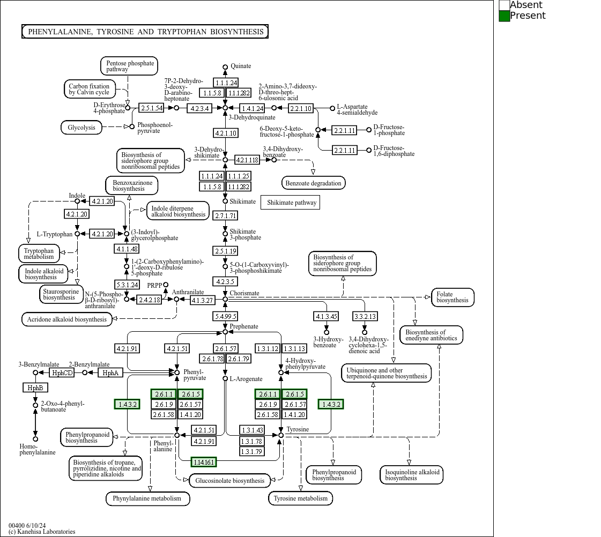
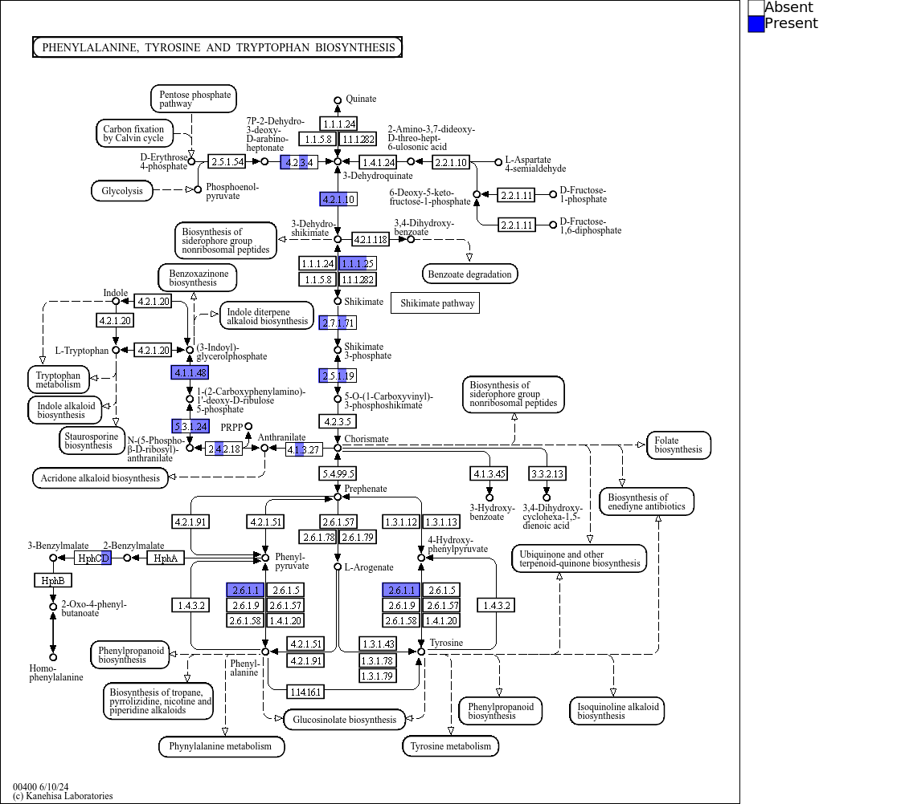
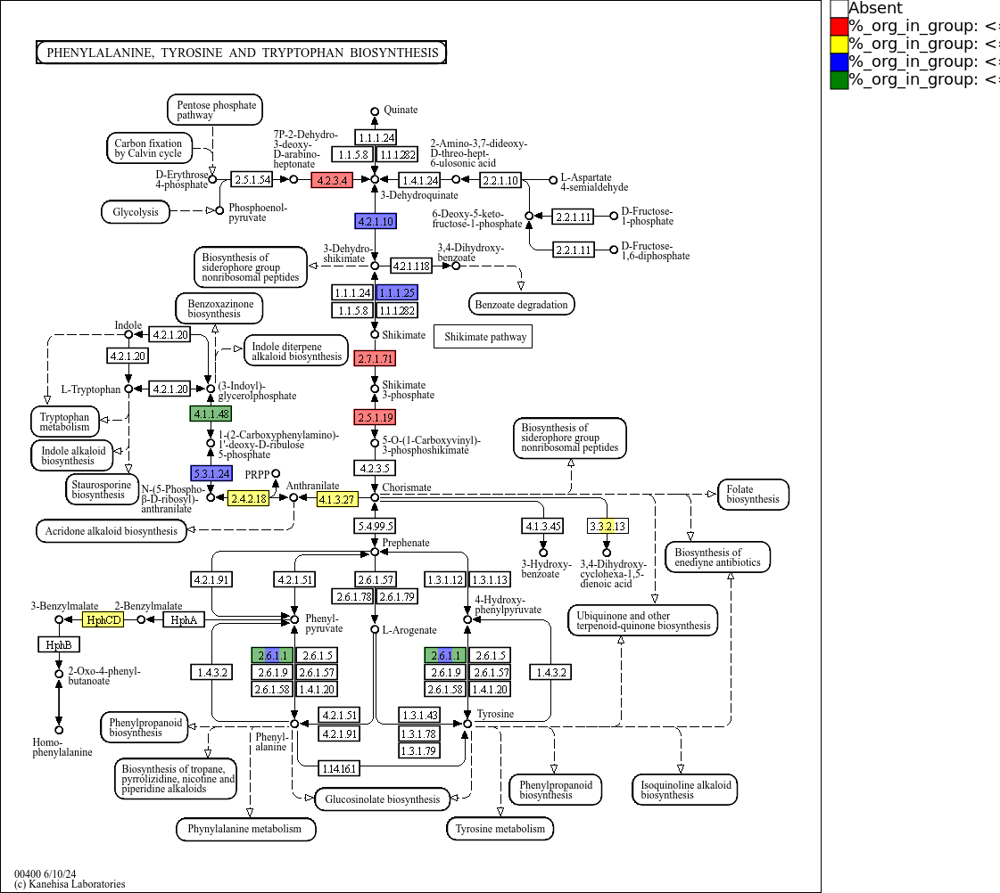

# KeggMapWizard

> **Warning**
> Using this tool may require a [KEGG subscription](https://www.kegg.jp/kegg/legal.html)!

This script downloads KEGG REST data, KEGG configs and KEGG PNGs and converts them into SVG maps which can be processed dynamically using modern
browsers.

I included a simple JavaScript library that enables coloring the maps. It requires

- jQuery
- [html2canvas](https://html2canvas.hertzen.com/) to render the SVGs as PNGs

## Python

### Creating the SVGs

Set the environment variable `KEGG_MAP_WIZARD_DATA` to where you want data to be downloaded to.

```bash
export KEGG_MAP_WIZARD_DATA='/path/to/desired/download/location'
```

or in Python:

```python
import os

os.environ['KEGG_MAP_WIZARD_DATA'] = '/path/to/desired/download/location'
```

In a Python 3.9 console, type:

```python
from kegg_map_wizard import KeggMapWizard, KeggMap, KeggShape, KeggAnnotation, ColorMaker

KeggMapWizard.download_kegg_resources()  # this will download all available KEGG maps and other required resources
KeggMapWizard.download_kegg_resources(map_ids=['00400'], org=['gma','mus'], reload=True) # this will only download this KEGG resources for the specified organims and maps


# Create KeggMap object
svg_map = KeggPathwayMap("00400")

# Create SVG
svg_map.create_svg_map()


```
By default, the rendered SVGs will be saved in a directory called 'SVG_output' within the KEGG_MAP_WIZARD_DATA directory. Output SVG will follow the following naming format:

names of available kgml files separated by '_' followed by the pathway map number.

For example:
when map number is '00001', depending on which reference KGML files are available from KEGG the output name wille be one of the following:

- ko00001.svg  - if only ko KGML reference file is available
- ko_ec00001.svg - if only ko and ec KGML reference files are available
- ko_rn00001.svg - if only ko and rn KGML reference files are available
- ko_ec_rn00001.svg - if ko, ec and rn KGML reference file are available

If organism prefix is provided with the map number this is also included in the output name.

For example:
when map number is 'hsa00001',depending on which reference KGML files are available from KEGG the output name wille be one of the following:

- ko_hsa00001.svg  - if only ko KGML reference file and organism-specific KGML files are available.
- ko_ec_hsa00001.svg - if only ko and ec KGML reference files and organism-specific KGML files are available.
- ko_rn_hsa00001.svg - if only ko and rn KGML reference files and organism-specific KGML files are available.
- ko_ec_rn_hsa00001.svg - if ko, ec and rn KGML reference file and organism-specific KGML files are  available.

Both the output directory and output name can be specified by the user as follows"
```python
# Create KeggMap object
svg_map = KeggPathwayMap("00400")
# Create SVG
svg_map.create_svg_map(path = 'path/to/desired/directory',output_name = 'desired_name')
```

By default, all shapes are transparent. Below are some examples on how to apply colors in python:

```python
# Create SVG
svg_map.create_svg_map(path = 'path/to/desired/directory',output_name = 'desired_name')
```
By default, all shapes are transparent. Below are some example functions for coloring that are included in color_function_base.py script:

```python
def color_all(*args, data):
    # Parse the element_tree object
    
    root = data
    elements = root.find('.//g')
    if args:
        color = args[0]
    else:
        color = 'blue'
    # Set the fill of each element to the specified color
    for element in elements:
        element.set('fill', color)
        element.set('stroke', color)
        element.set('stroke-width', '3')
        element.set('fill', color)
        element.set('fill-opacity', '0.5')
    
    return root

def color_org(org,*args, data):
    # Parse the element_tree object
    root = data
    elements = root.find('.//g')
    # Determine the color to use; default to 'blue' if not provided
    color = args[0] if args else 'blue'
    
    # Set the stroke of each element to the specified color

    for shapes in elements:
        # Extract the title element from shapes
        title_element = shapes.find('title')
      
        # Extract the title text if the title element           
        title_text = eval(title_element.text)
        
        # process the organism prefix to match the format in SVG
        query = org + ":"
        
        if any(query in item for item in title_text):
            
            shapes.set('stroke', color)
            shapes.set('stroke-width', '3')
            shapes.set('fill', color)
            shapes.set('fill-opacity', '0.15')
    
    return root

```

In the color_function_base.py script, additional functions for coloring are available. The functions presented above are shown to provide users with an intuitive understanding of how to navigate the hierarchical structure of SVG files and to create custom coloring functions tailored to their specific needs.

Users need to import the modules with color function prior to their use as follows:

```python
from color_function_base import color_all, color_org, color_custom_annotations
from color_functions_color_groups import add_linear_gradient_groups
```

The above mentioned functions can be called as follows:

```python
# Create KeggMap object
svg_map = KeggPathwayMap("00400")
# Create SVG
svg_map.create_svg_map(color_function, additional_arguments, path = 'path/to/desired/directory',output_name = 'desired_name')
```
Usecase examples are as follows:

```python
# Create KeggMap object
svg_map = KeggPathwayMap("00400")
# Create SVG
svg_map.create_svg_map(color_all, 'green', path = "./resources/")
```


```python
# Create KeggMap object
svg_map = KeggPathwayMap("hsa00400")
# Create SVG
svg_map.create_svg_map(color_org,'hsa','green',path = "./resources/",output_name="org_specific_visualization")
```



The color_function_base.py script includes additional coloring functions. For example, the following code illustrates how to color a pathway map using genome-specific annotation data, specifically the color_custom_annotations function from the same script.

```python
annotation_data = {'genome1': ['K13830', 'K01609', 'K14455', 'K24017'],
 'genome2': ['K01609', 'K13832', 'K14455', 'K13497'],
 'genome3': ['K13830', 'K24017', 'K14455', 'K01609'],
 'genome4': ['K17749', 'K01609', 'K14455', 'K24017']}

# Create KeggMap object
svg_map = KeggPathwayMap("00400")
# Create SVG
svg_map.create_svg_map(color_custom_annotations,annotation_data,'red',path = "./resources/",output_name="customized_coloring_multtiple_genome")
```


Additionally, a list of custom colors can also be provided for each genome annotation.

```python
annotation_data = {'genome1': ['K13830', 'K01609', 'K14455', 'K24017'],
 'genome2': ['K01609', 'K13832', 'K14455', 'K13497'],
 'genome3': ['K13830', 'K24017', 'K14455', 'K01609'],
 'genome4': ['K17749', 'K01609', 'K14455', 'K24017']}

# Create KeggMap object
svg_map = KeggPathwayMap("00400")
# Create SVG
svg_map.create_svg_map(color_custom_annotations,annotation_data,['yellow', 'red', 'blue', 'green'],path = "./resources/",output_name="customized_coloring_multtiple_genome_multiple_colors")
```


In addition, the script color_functions_color_groups.py contains specialized functions designed to color map objects by grouping. It evaluates the percentage of genomes with specific annotations within each group and assigns colors to the map objects based on these percentages. In this approach, the pathway object is divided into multiple sections, corresponding to the number of groups, with each section colored appropriately.

```python

annotation_data = [[{'genome1': ['K13830', 'K01609', 'K14455', 'K24017'],
   'genome2': ['K01609', 'K13832', 'K14455', 'K13497'],
   'genome3': ['K13830', 'K24017', 'K14455', 'K01609'],
   'genome4': ['K17749', 'K01609', 'K14455', 'K24017']}],
 [{'genome1': ['K13830', 'K01609', 'K18239', 'K24017'],
   'genome2': ['K01609', 'K13832', 'K14455', 'K13497'],
   'genome3': ['K13830', 'K24017', 'K14455', 'K01609'],
   'genome4': ['K17749', 'K01609', 'K14455', 'K24017']}],
 [{'genome1': ['K13830', 'K01609', 'K14455', 'K24017'],
   'genome2': ['K01609', 'K13832', 'K14455', 'K13497'],
   'genome3': ['K13830', 'K24017', 'K14455', 'K01609'],
   'genome4': ['K17749', 'K01609', 'K14455', 'K24017']}]]

# Create KeggMap object
svg_map = KeggPathwayMap("hsa00400")
# Create SVG
svg_map.create_svg_map(add_linear_gradient_groups,annotation_data,path = "./resources/",output_name="color_by_group")
```


Isolating the color functions into a separate module enables users to modify or introduce custom coloring functions. This modularity allows for adjustments to the input format and the default color settings as needed.

> **Warning**

> In the coloring functions defined within the color_function_base.py script, color specifications must be included as the final additional argument, preceding the path and output name. This design choice was made to enhance usability; however, users are encouraged to develop their own coloring functions to suit their specific requirements.

## Testing and Coloring SVGs in a browser
To test the maps, run a simple http server in the kegg_map_wizard: python -m http.server 8000
Then open http://localhost:8000/html/html/display_SVG.html